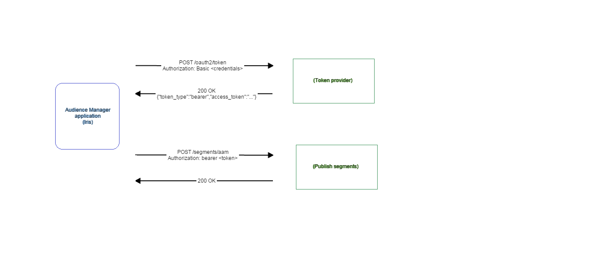

# LAB - Class 13

## Project: auth-server

### Author: Anolla Haddad

### Links and Resources

<!-- - [Swagger](http://xyz.com) -->
- [submission PR](https://github.com/401-advanced-javascript-Anolla/auth-server/pull/3)
<!-- - [ci/cd](http://xyz.com) (GitHub Actions) -->
<!-- - [back-end server url](http://xyz.com) (when applicable) -->
<!-- - [front-end application](http://xyz.com) (when applicable) -->

### Setup

#### `.env` requirements (where applicable)

i.e.

- `PORT` - 3000
<!-- - `MONGODB_URI` - URL to the running mongo instance/db -->

#### How to initialize/run your application (where applicable)

- `npm start`

#### How to use your library (where applicable)

#### Tests

- `npm test`

#### UML

